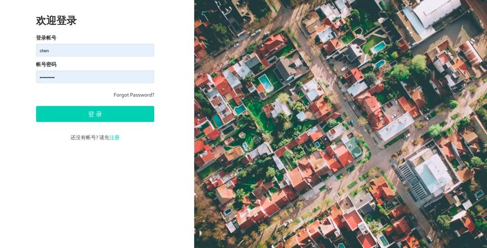
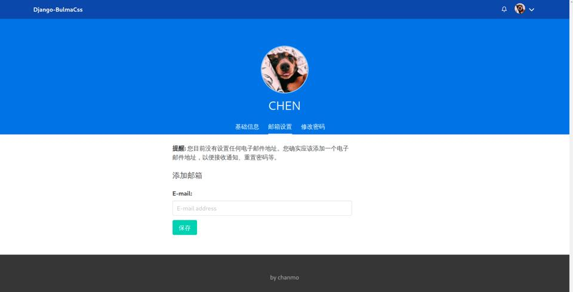

Bulma主题模板
=============

基于`bulma.css`为Django开发提供常用的页面模板

Screenshots
-----------

   Login Page

   User Profile

Quick Start
-----------

Install Package

.. code:: bash

   pip install django-bulmacss

修改`settings.py\`

.. code:: bash

   INSTALLED_APPS = [
       'bulma',
       ...
   ]

   FORM_RENDERER = 'django.forms.renderers.TemplatesSetting'

Includes
--------

Basic Templates
~~~~~~~~~~~~~~~

-  base.html
-  index.html
-  navbar.html
-  footer.html
-  profile.html
-  empty.html
-  pagination.html
-  search\ :sub:`bar`.html
-  messages.html

django.contrib.auth
~~~~~~~~~~~~~~~~~~~

-  registration

django-allauth
~~~~~~~~~~~~~~

-  account

form
~~~~

-  django

django-flatpages
~~~~~~~~~~~~~~~~

-  flatpages/default.html

django-filters
~~~~~~~~~~~~~~

-  filters.html

Extra
-----

Feather Icons
~~~~~~~~~~~~~

Simply beautiful open source icons

https://feathericons.com/

Jdenticon
~~~~~~~~~

Open source library for generating identicons.

https://jdenticon.com/
